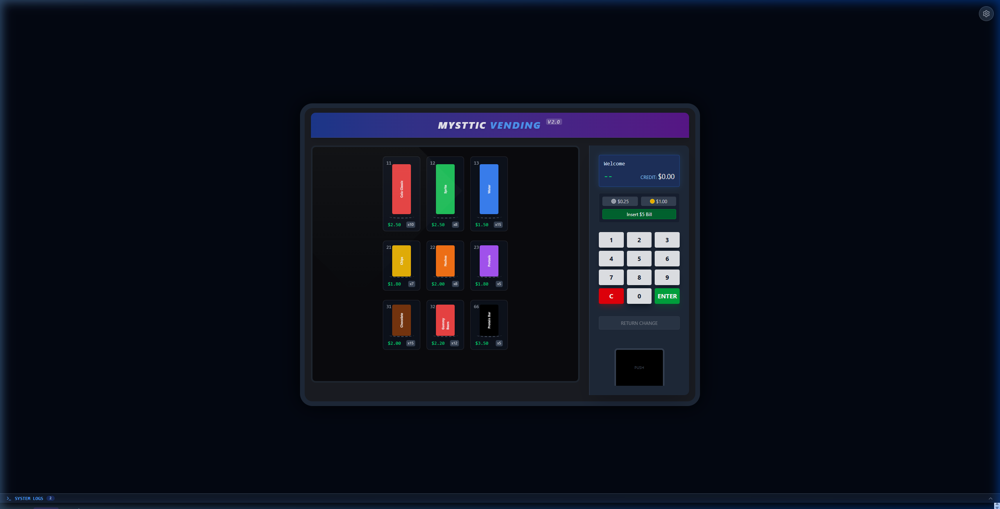
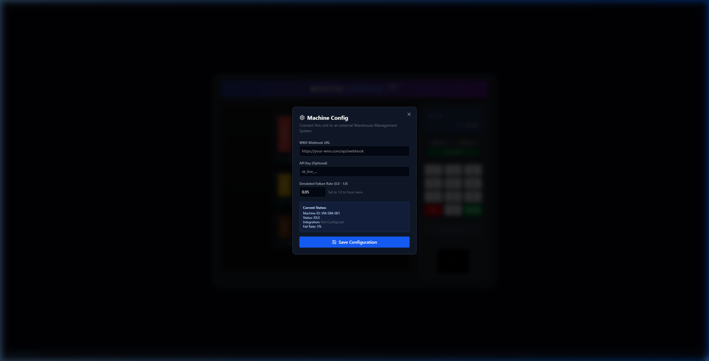
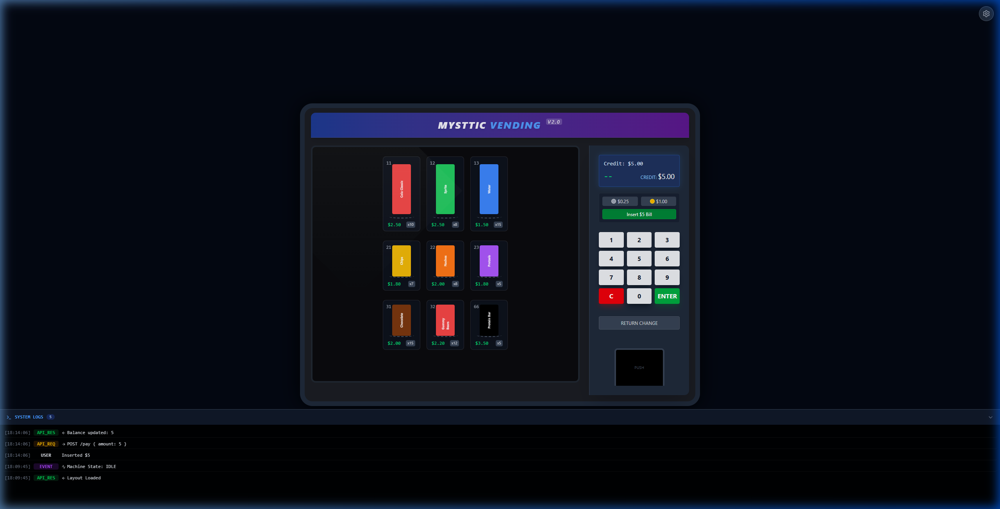
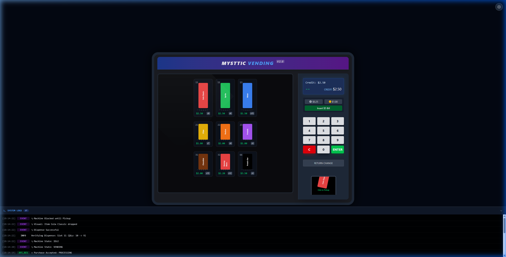

# Vending Machine Simulator Project

A comprehensive IoT simulation project designed for testing integrations with Warehouse Management Systems (WMS). The system provides a high-fidelity virtual representation of a vending machine, complete with hardware-level logic and inventory tracking.

---

## 🔐 Logowanie do panelu

Panel otwiera się na ekranie logowania i przed zalogowaniem nie renderuje ani nie
odpytuje niczego. Symulator bywa instalowany u klienta na stanowisku dostępnym
dla osób nieuprawnionych i chodzi o to, żeby nikt postronny w nim nie klikał.

| Zachowanie | Szczegóły |
|---|---|
| Domyślne poświadczenia | `admin` / `vending` |
| Czas życia sesji | `sessionStorage` — zamknięcie karty kończy sesję |
| Bezczynność | auto-wylogowanie po 30 minutach (`UI_IDLE_MINUTES`) |
| Nieudane próby | 5 z rzędu blokuje formularz na 30 sekund |

> **To blokada interfejsu, nie zabezpieczenie API.** Backend jest nietknięty —
> endpointy odpowiadają dokładnie jak dotąd, więc automatyzacja, testy i kontrakt
> integracji działają bez żadnego dodatkowego nagłówka.

Własne hasło u klienta, bez zmiany kodu:

```bash
node scripts/ui-password-hash.cjs admin TwojeHaslo
```

Wynik wklej do `.env` obok `docker-compose.yml` (wzór: `.env.example`):

```ini
UI_USER=admin
UI_PASSWORD_HASH=<hash z komendy wyżej>
UI_IDLE_MINUTES=30
```

i przebuduj obraz UI:

```bash
docker compose up -d --build client
```

Przy pracy lokalnej (`npm run dev`) te same wartości podaje się z prefiksem
`VITE_`, np. `VITE_UI_PASSWORD_HASH=... npm run dev`.


## 📸 System Showcase

### Main Interface
The primary user interaction point, featuring a sleek dark theme, vibrant product cards, and a functional keypad.


*Figure 1: High-fidelity visual representation of the vending unit.*

### Configuration & Management
The hidden Admin Panel allows for real-time adjustments to the machine's operational parameters.


*Figure 2: Administrative dashboard for machine tuning.*

### Real-Time Diagnostics
Development-focused system logs provide visibility into the simulator's internal events and communication.


*Figure 3: Live telemetry and event tracking (expanded view).*

---

## 🛒 User Flow: Purchasing a Product

The simulator provides a step-by-step visual and logical progression for every transaction.

1. **Payment**: Users can simulate inserting cash ($5.00). The system updates credit in real-time.
   

2. **Selection**: Entering a code (e.g., `11`) validates the product availability.
   

3. **Dispense**: The machine reduction stock and 'drops' the item. The logs record all internal events.
   

4. **Pickup & Return**: After picking up the item, the user can request a refund of the remaining balance.
   

---

## 📂 Project Structure

*   [**server/**](./server/README.md): **Machine Controller API**.
    *   REST API for external integration (Inventory, Remote Commands).
    *   Webhook Event Emitter (Sale, Low Stock).
    *   Node.js + Express.
*   [**client/**](./client/README.md): **Visual Simulator**.
    *   Interactive hardware simulation (Glass front, Keypad, Coin mechanism).
    *   Admin configuration panel.
    *   React + TailwindCSS.

## 🚀 Quick Start

To run the full simulator, you need to start both services.

1.  **Start the Backend** (Port 3000)
    ```bash
    cd server
    npm install
    npm start
    ```

2.  **Start the Frontend** (Port 5173)
    ```bash
    cd client
    npm install
    npm run dev
    ```

---

## ⚙️ Technical Stack
- **Frontend**: React, TailwindCSS, Lucide Icons, Framer Motion (for animations).
- **Backend**: Node.js, Express.
- **Infrastructure**: Docker & Docker Compose for orchestrated deployment.
- **Networking**: REST API & Webhooks.

## 🔗 Integration Guide

This simulator is designed to act as an edge device. It exposes an API for your WMS to poll data and pushes events when specific actions occur.

For detailed API specifications, see the [Backend Documentation](./server/README.md).
For user interface guides, see the [Frontend Documentation](./client/README.md).
