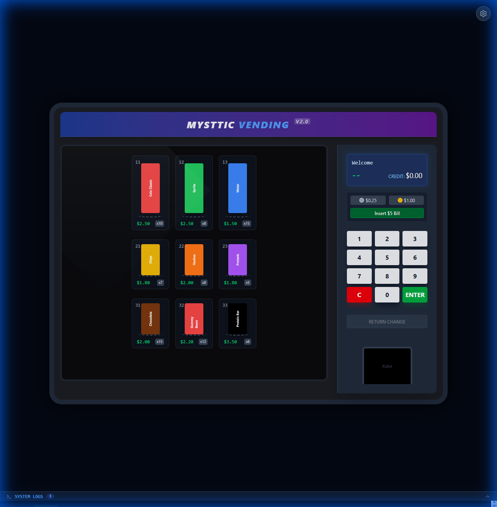
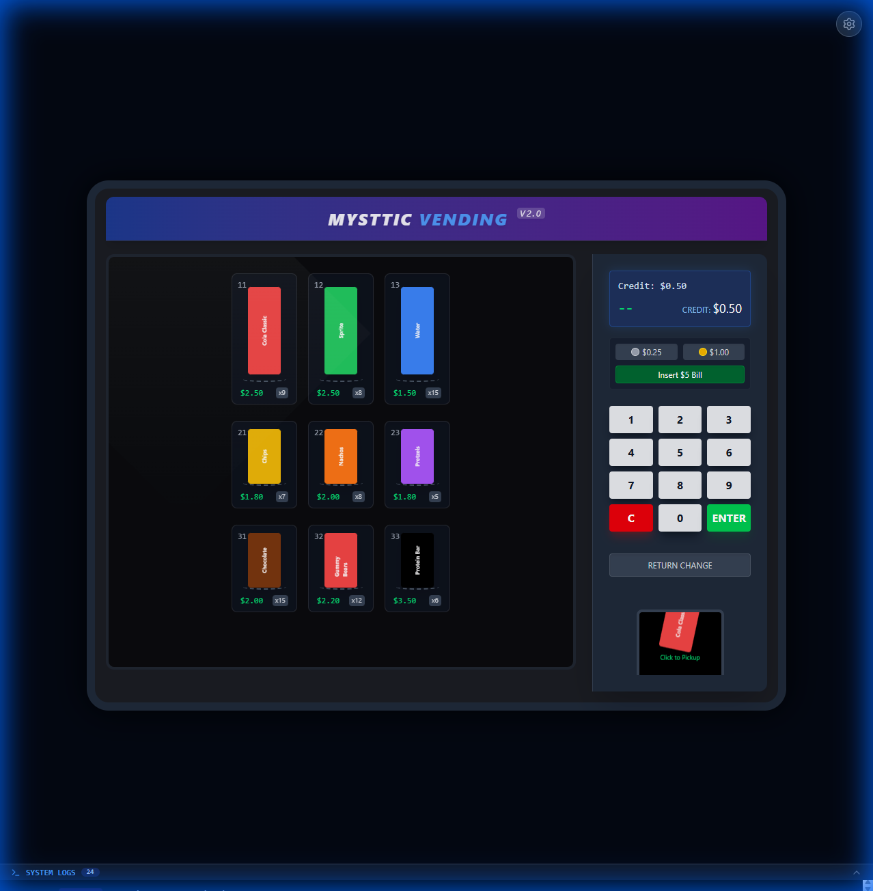
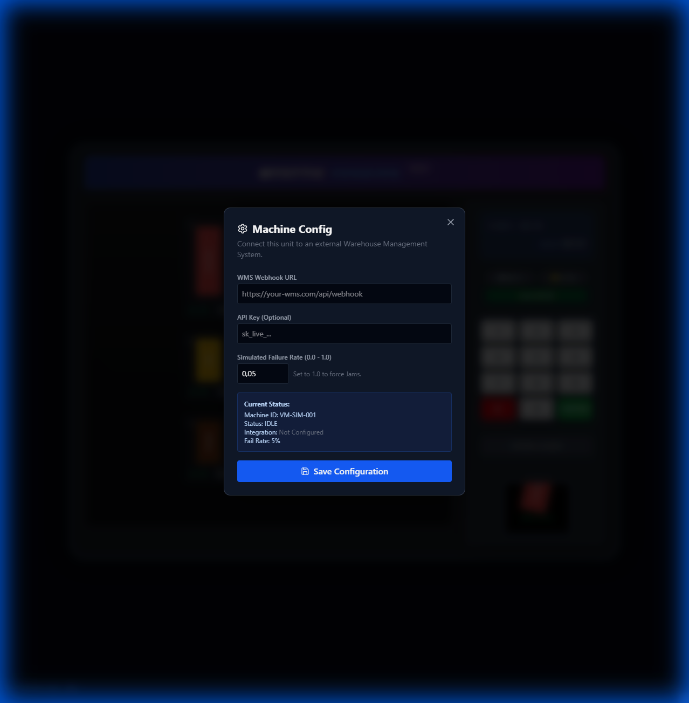

# Vending Machine Simulator (Frontend)

The frontend provides an interactive, visual simulation of the vending machine hardware. It mimics a physical glass-front machine with a keypad, coin slots, and a digital display.

## 🚀 Getting Started

### Prerequisites
*   Node.js (v18+)

### Running the Simulator
```bash
npm install
npm run dev
```
The application will launch on `http://localhost:5173`.

## 📸 Interface Documentation

### 1. Main Interface
The user interface mimics a physical machine.
- **Top:** "MYSTTIC VENDING" Branding.
- **Center:** Glass window showing products with real-time stock levels. Empty slots are visually dimmed.
- **Right:** Control Panel (LCD Display, Coin Slots, Keypad).
- **Bottom:** Collapsible **Debug Logs** panel.



### 2. Making a Purchase
The simulation flow supports a realistic vending cycle:
1.  **Insert Credit:** Click the `$0.25`, `$1.00`, or `$5.00` buttons.
2.  **Select Product:** Use the keypad to type the Slot ID (e.g., `11`, `23`).
3.  **Vending:** The machine processes the order, deduces stock, and returns a success message.
4.  **Visual Drop:** The dispensed product appears in the bottom "Pickup Box" for 5 seconds before being collected.



### 3. WMS Configuration Panel
Access the hidden settings menu by clicking the **Gear Icon** in the **Top-Right** corner.
Use this panel to "hot-swap" the integration endpoint without restarting the server.
- **Webhook URL:** The destination for event notifications (e.g., [webhook.site](https://webhook.site)).
- **Simulated Failure Rate:** Adjust the slider/input to simulate jam probability (0.0 to 1.0).



## ⚙️ Simulation Logic

### Visual Verification System
The frontend simulates a physical "Drop Sensor" to confirm dispensing.
1.  **Polling:** The client polls `/api/v1/layout` every second.
2.  **Diff Check:** When a "VENDING" cycle completes, the client compares the *Old Inventory Count* vs the *New Inventory Count* for the selected slot.
    *   **Count Decreased**: Confirmed Drop. The visual item animation plays.
    *   **Count Unchanged**: Jam Detected. The machine goes into Error state, and **no item** is dispensed.

### Manual Pickup
To simulate real-world interaction:
*   Items in the "Pickup Box" do not disappear automatically.
*   **Action**: You must **click the item** to remove it.
*   **Interlock**: You cannot purchase a new item until the previous one is collected.

## 🛠 Technology Stack
*   **React 19**: Interactive UI library.
*   **Vite**: Fast build tool and dev server.
*   **TailwindCSS v4**: Styling engine.
*   **Axios**: For API communication with the backend.
